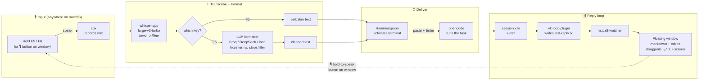

# 🎙 vk — Voice Kit for opencode

**Free, local, open-source voice control for the [opencode](https://opencode.ai) coding agent.**

Push-to-talk dictation with LLM formatting and a floating reply window — a self-hosted alternative to superwhisper, built specifically for hands-free coding. Runs everything locally on Apple Silicon; **$0/month**.

```
🎙 Hold F6 anywhere → speak your task → release
   opencode works...
🪟 Floating window pops with the rendered reply
🎙 Hold F6 again → speak your follow-up → loop
```

---

## How it works



### Components

| Piece | What it does | Where it lives |
|---|---|---|
| **whisper.cpp** + large-v3-turbo | Local, offline speech-to-text (Apple Silicon accelerated) | `~/.voice-kit/models/` |
| **sox** | Microphone capture | `/opt/homebrew/bin/sox` |
| **Hammerspoon** | Global hotkeys, hold-to-talk, pasting, floating window, mic auto-switching | `~/.hammerspoon/init.lua` |
| **vk CLI** | Record → transcribe → format → clipboard pipeline | `~/.voice-kit/vk` |
| **LLM formatter** | Corrects technical terms (namp→nmap), strips filler words, keeps intent | Groq / DeepSeek / any OpenAI-compatible endpoint |
| **vk-loop plugin** | Catches opencode's `session.idle`, saves reply, triggers the popup | `~/.config/opencode/plugin/vk-loop.js` |
| **Floating window** | Renders replies (markdown + tables), drag, ⤢ full-screen, 🧹 clear, 🎙 hold-to-speak | Hammerspoon webview |

---

## Install

Requirements: macOS 14+, Apple Silicon, [Homebrew](https://brew.sh), [opencode](https://opencode.ai), a [Groq](https://console.groq.com/keys) API key (free tier works — or point the formatter at DeepSeek/any OpenAI-compatible endpoint).

```bash
git clone https://github.com/prakashchand72/vk-voice-kit.git
cd vk-voice-kit
./install.sh
```

The installer:
1. `brew install whisper-cpp sox hammerspoon`
2. Downloads Whisper **large-v3-turbo** (~1.5 GB, one-time, offline afterwards)
3. Installs `vk` CLI, Hammerspoon config, and the opencode reply plugin
4. Creates `~/.voice-kit/config` — **paste your Groq API key there**
5. Prints the manual permission steps (macOS requires a human click)

### Manual permissions (one-time)
- **System Settings → Privacy & Security → Accessibility** → enable Hammerspoon
- **System Settings → Privacy & Security → Microphone** → enable Hammerspoon
- Restart **opencode** once (loads the reply-loop plugin)

---

## Usage

| Action | Result |
|---|---|
| Hold **F5** anywhere, speak, release | Verbatim dictation → pasted **and auto-submitted to opencode** |
| Hold **F6** anywhere, speak, release | LLM-formatted text → auto-submitted to opencode |
| Click **🎙 hold to speak** on the floating window | Mouse-driven voice input — no keys |
| Reply finishes | Pops in the floating window (persistent, draggable, ⤢ full-screen, 🧹 clear) |
| Click the 🎙 **menu-bar icon** | Reopens the floating window with the most recent reply |

### CLI

```bash
vk rec [secs]     # record -> transcribe -> format -> clipboard
vk hold [--raw]   # process a push-to-talk recording (--raw = verbatim)
vk mics           # list input devices
vk mic <n|name|auto>  # pin a mic (auto-detect is the default)
vk stt <wav>      # transcribe an existing file
vk fmt "text"     # run the LLM formatter only
vk test           # whisper plumbing self-test
```

---

## Configuration

Everything lives in `~/.voice-kit/config` (sourced by every run):

```bash
GROQ_API_KEY="gsk_…"                    # formatter brain
export VK_FORMAT_MODEL="openai/gpt-oss-20b"
VK_MIC="auto"                           # or pin: "PD100X Podcast Microphone"
```

- **Mic auto-switching**: prefers USB/podcast mics → built-in mic → never virtual devices (BlackHole, Teams audio). Switches within 5 minutes of a device change, or instantly after a silence failure.
- **Silence guard**: recordings below the amplitude threshold warn instead of pasting garbage.
- **Transparency / styling**: the window CSS is at the top of `~/.hammerspoon/init.lua`.

---

## Troubleshooting

| Symptom | Fix |
|---|---|
| "captured SILENCE" alert | Wrong/default input device → `vk mics`, then `vk mic <n>`. Check mic isn't muted. |
| "sox: command not found" in Hammerspoon | GUI apps have a minimal PATH — the config already exports `/opt/homebrew/bin`; make sure you're on the latest `init.lua`. |
| No floating window on replies | Restart opencode (plugin loads at startup). Check `~/.voice-kit/vk-loop.log`. |
| Text pastes into the wrong app | The window auto-activates kitty (your opencode terminal). Edit `sendToOpencode()` in `init.lua` to target a different terminal. |
| Whisper hears nothing but you spoke | Check `vk mics` shows your mic, speak *during* the hold, watch the 5-min mic cache. |

---

## Privacy & Cost

- **Audio never leaves your Mac** — transcription is 100% local (whisper.cpp).
- The only cloud calls are the **formatter**: the dictated *text* to your chosen LLM provider. Groq free tier, DeepSeek, or a local llama.cpp/Ollama server all work — set `VK_RAW=1` in `~/.voice-kit/config` to skip formatting entirely and go fully offline.
- No telemetry, no license servers, no subscriptions.

## Credits

Built on [whisper.cpp](https://github.com/ggerganov/whisper.cpp), [Hammerspoon](https://www.hammerspoon.org/), [sox](https://sox.sourceforge.io/), and the [opencode](https://opencode.ai) plugin API. Inspired by [superwhisper](https://superwhisper.com/) — which this project fully replaces for opencode workflows, at $0/month.

## License

MIT
