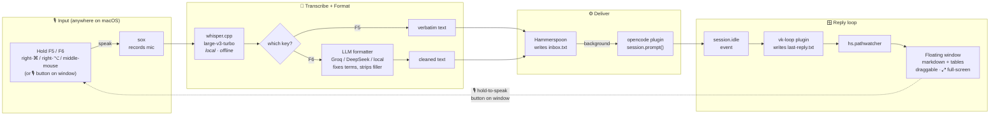

# 🎙 vk — Voice Kit for opencode

**Free, local, open-source voice control for the [opencode](https://opencode.ai) coding agent.**

Push-to-talk dictation with LLM formatting and a floating reply window — a self-hosted alternative to superwhisper, built specifically for hands-free coding. Runs everything locally on Apple Silicon; **$0/month**.

```
🎙 Hold F6 anywhere → speak your task → release
   opencode works...
🪟 Floating window pops with the rendered reply
🎙 Hold F6 again → speak your follow-up → loop
```

---

## How it works



### Components

| Piece | What it does | Where it lives |
|---|---|---|
| **whisper.cpp** + large-v3-turbo | Local, offline speech-to-text (Apple Silicon accelerated) | `~/.voice-kit/models/` |
| **sox** | Microphone capture | `/opt/homebrew/bin/sox` |
| **Hammerspoon** | Global hotkeys, hold-to-talk, background send, floating window, TTS, mic auto-switching | `~/.hammerspoon/init.lua` |
| **vk CLI** | Record → transcribe → format → clipboard pipeline | `~/.voice-kit/vk` |
| **LLM formatter** | Corrects technical terms (namp→nmap), strips filler words, keeps intent | Groq / DeepSeek / any OpenAI-compatible endpoint |
| **vk-loop plugin** | Catches opencode's `session.idle`, saves reply, triggers the popup | `~/.config/opencode/plugin/vk-loop.js` |
| **Floating window** | Renders replies (markdown + tables), drag, ⤢ full-screen, 🧹 clear, 🔊 voice toggle, 🎙 hold-to-speak | Hammerspoon webview |
| **Audio cues** | Walkie-talkie start/stop chimes on push-to-talk + text-to-speech of replies | `~/.voice-kit/sounds/` |

---

## Install

Requirements: macOS 14+, Apple Silicon, [Homebrew](https://brew.sh), [opencode](https://opencode.ai), a [Groq](https://console.groq.com/keys) API key (free tier works — or point the formatter at DeepSeek/any OpenAI-compatible endpoint).

```bash
git clone https://github.com/prakashchand72/vk-voice-kit.git
cd vk-voice-kit
./install.sh
```

The installer:
1. `brew install whisper-cpp sox hammerspoon`
2. Downloads Whisper **large-v3-turbo** (~1.5 GB, one-time, offline afterwards)
3. Installs `vk` CLI, Hammerspoon config, and the opencode reply plugin
4. Creates `~/.voice-kit/config` — **paste your Groq API key there**
5. Prints the manual permission steps (macOS requires a human click)

### Manual permissions (one-time)
- **System Settings → Privacy & Security → Accessibility** → enable Hammerspoon
- **System Settings → Privacy & Security → Microphone** → enable Hammerspoon
- Restart **opencode** once (loads the reply-loop plugin)

---

## Usage

| Action | Result |
|---|---|
| Hold **F5** anywhere, speak, release | Verbatim dictation → sent to opencode **in the background** |
| Hold **F6** anywhere, speak, release | LLM-formatted text → sent to opencode **in the background** |
| Hold **right-⌘** / **right-⌥** / **middle mouse** | Same as F5 (⌘ and middle) / F6 (⌥) |
| **F7** | Focus the opencode console (kitty) to inspect the full session |
| Click **🎙 hold to speak** on the floating window | Mouse-driven voice input — no keys |
| Reply finishes | Pops in the floating window (rendered + **spoken aloud** if voice is on) |
| Click **🔊 Voice / 🔇 Mute** in the window footer | Toggle text-to-speech on/off (persistent) |
| Press a push-to-talk key | **Start chime** on press, **stop chime** on release (audio feedback) |
| Click the 🎙 **menu-bar icon** | Reopens the floating window with the most recent reply |

### CLI

```bash
vk rec [secs]     # record -> transcribe -> format -> clipboard
vk hold [--raw]   # process a push-to-talk recording (--raw = verbatim)
vk mics           # list input devices
vk mic <n|name|auto>  # pin a mic (auto-detect is the default)
vk server start|stop|status|install  # resident whisper server (install = auto-start at login)
vk stt <wav>      # transcribe an existing file
vk fmt "text"     # run the LLM formatter only
vk test           # whisper plumbing self-test
```

---

## Configuration

Everything lives in `~/.voice-kit/config` (sourced by every run):

```bash
GROQ_API_KEY="gsk_…"                    # formatter brain
export VK_FORMAT_MODEL="openai/gpt-oss-20b"
VK_MIC="auto"                           # or pin: "PD100X Podcast Microphone"
# VK_FORMAT_URL="https://api.deepseek.com/chat/completions"  # any OpenAI-compatible endpoint
# VK_FORMAT_KEY="sk-…"                  # key for the above
# VK_RAW=1                              # skip LLM formatting (fully offline)
# VK_WHISPER_PORT=8081                  # whisper-server port
```

- **Mic auto-switching**: follows the macOS system default input device — auto-switches when you connect/disconnect earphones, Bluetooth, USB mics. Pin a device with `vk mic <name>`.
- **Silence guard**: recordings below the amplitude threshold warn instead of pasting garbage.
- **Low-latency whisper**: `vk server start` launches a resident whisper-server (model loads once). `transcribe` auto-detects it and uses it, otherwise falls back to `whisper-cli`. Run `vk server install` once to auto-start it at login (via a launchd LaunchAgent).
- **Transparency / styling**: the window CSS is at the top of `~/.hammerspoon/init.lua`.

---

## 🎛 Jarvis fast-path router (instant media & volume)

Short, unambiguous media/system phrases are handled **instantly** — no opencode round-trip, no waiting. The status pops in the floating window and is spoken aloud.

| Say (on F6) | What happens |
|---|---|
| "volume up" / "volume down" / "mute" / "unmute" | System volume (any app) |
| "set the volume to 40" / "volume max" | Absolute level |
| "play music" / "pause the video" / "resume" | Play/pause the video in Chrome's **active tab** |
| "next track" / "previous track" | Click YouTube's next/previous |
| "skip ad" | Skip the YouTube ad if present |
| "what's playing" / "now playing" | Report the tab title + volume |

**Design rule:** the router only claims a command when it is short, clearly media/system, and doesn't reference coding/agent work. Compound requests ("pause the music **and run the scan**") or specific-song requests ("play shape of you on youtube") fall through to the opencode brain untouched.

- **Chrome requirement (one-time):** Chrome → View → Developer → **Allow JavaScript from Apple Events**. Also grant the host permission when macOS prompts.
- **Config:** `VK_ROUTER=0` disables the router; `VK_BROWSER` swaps the target browser.
- **Dry-run** any phrase: `vk route "pause the music"` prints the action it *would* take (or `--act` to execute).

```
$ vk route "turn it down"
match → vol:down
$ vk route "pause the video"
match → media:pause
$ vk route "pause the scan"
no match — would go to opencode
```

## 🧠 Jarvis brain (opencode reaches your Mac)

The fast path covers snappy one-liners; everything deeper is still opencode's job. To make opencode itself able to trigger the same actions (plus launch apps), register the bundled `vk-tools` MCP server in `~/.config/opencode/opencode.json`:

```json
{
  "$schema": "https://opencode.ai/config.json",
  "mcp": {
    "vk-tools": {
      "type": "local",
      "command": ["node", "/Users/YOU/.voice-kit/mcp/vk-tools.js"],
      "enabled": true
    }
  }
}
```

Restart opencode, and its agent can `media_play`, `media_pause`, `set_volume`, `mute`, `open_app`, `now_playing`, skip ads, etc. — e.g. *"play music"* or *"open Spotify and set volume to 30"*. Zero extra voice plumbing: replies still arrive in the floating window.

**Extending reachability = adding MCP servers.** Browser control is already here (this plugin bundles Playwright), and the same pattern extends to Home Assistant, Calendar, AppleScript, etc.

---

## Troubleshooting

| Symptom | Fix |
|---|---|
| "captured SILENCE" alert | Wrong/default input device → `vk mics`, then `vk mic <n>`. Check mic isn't muted. |
| "sox: command not found" in Hammerspoon | GUI apps have a minimal PATH — the config already exports `/opt/homebrew/bin`; make sure you're on the latest `init.lua`. |
| Quick phrase ("next track") goes to opencode anyway | The router only intercepts Chrome/YouTube when **Chrome is running**. Volume/mute always work. Check the phrase isn't long/compound or coding-related — `vk route "your phrase"` dry-runs it. |
| "Chrome automation blocked" status | Enable Chrome → View → Developer → **Allow JavaScript from Apple Events** and approve the automation prompt once. |
| No floating window on replies | Restart opencode (plugin loads at startup). Check `~/.voice-kit/vk-loop.log`. |
| Text pastes into the wrong app | Voice now sends via `inbox.txt` → plugin (no paste). If opencode isn't running, kitty auto-launches. |
| Voice command does nothing | Make sure opencode is running and restarted after updating the plugin (`~/.config/opencode/plugin/vk-loop.js`). Check `~/.voice-kit/vk-loop.log`. |
| Whisper hears nothing but you spoke | Check `vk mics` shows your mic, speak *during* the hold, watch the 5-min mic cache. |

---

## Privacy & Cost

- **Audio never leaves your Mac** — transcription is 100% local (whisper.cpp).
- The only cloud calls are the **formatter**: the dictated *text* to your chosen LLM provider. Groq free tier, DeepSeek, or a local llama.cpp/Ollama server all work — set `VK_RAW=1` in `~/.voice-kit/config` to skip formatting entirely and go fully offline.
- No telemetry, no license servers, no subscriptions.

## Credits

Built on [whisper.cpp](https://github.com/ggerganov/whisper.cpp), [Hammerspoon](https://www.hammerspoon.org/), [sox](https://sox.sourceforge.io/), and the [opencode](https://opencode.ai) plugin API. Inspired by [superwhisper](https://superwhisper.com/) — which this project fully replaces for opencode workflows, at $0/month.

## License

MIT
